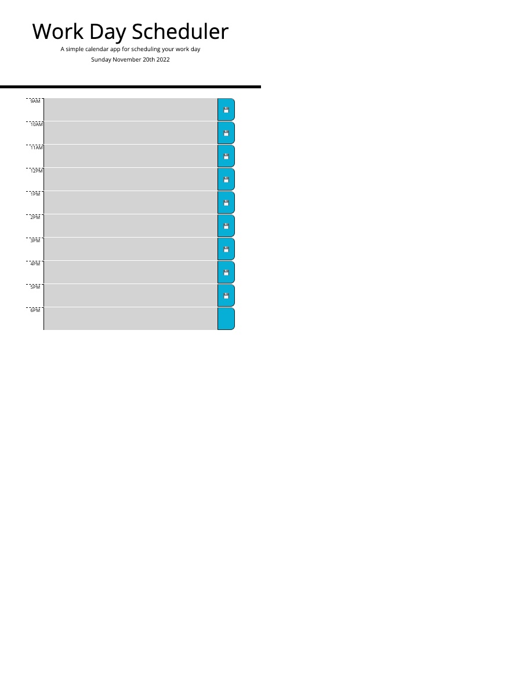

# Work Day Scheduler

## Description

Work Day Scheduler is a simple day calendar application that allows the user to input and plan events for each hour of the day. The motivation behind the challenge was to use knowledge that I learned in class regarding DOM navigation, javascript, and some jQUery. I also incorporated moment to display the current date, as well as adding the events of the scheduler to local storage. 

## Links

Github: 
Deployed link: https://samkstark.github.io/work-day-scheduler/

## Usage

 

## Credits

The starter code used was created by The Coding Bootcamp
https://github.com/coding-boot-camp/crispy-octo-meme
